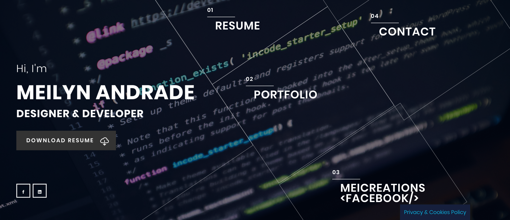
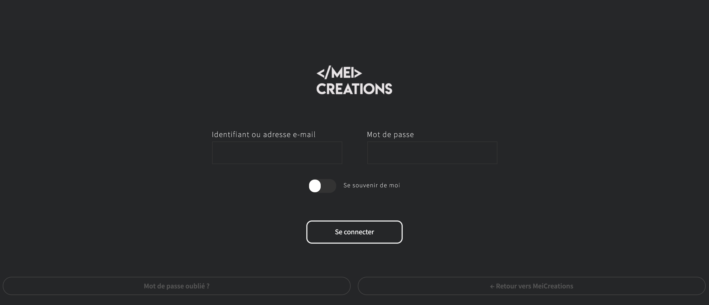

**Realisation**: Meilyn ANDRADE

**Création**: Mai 2019

**URL**: www.meicreations.com

**Status**: En construction.

### Techologie Utilise

1. Wordpress
2. HTML/CSS
 
### A PROPOS

Réalisation d'un CV en ligne!
Cette One page est realisée avec le fin de montrer mes competences depuis mon arrivée à BeCode. La page est compose d'un accueil, un formulaire de contact avec un Captcha pour eviter le spam. 
Dans le porfolio il aura tous mes travaux dans le domain du Design et developpement. Aussi avec un accès direct à la page Facebook.
Dans l'onglet RESUME, Ceci sera la partie plus important car elle contiendra mes competences, et parlera un peu de moi. 

Dans le boutton *Download RESUME* c'est mon CV en PDF. Practique pour les employeurs.  

Mon Website est conforme a la loi **GDPR**.

### PAGE D'ACCUEIL

### TABLEAU DE BORD

